# GroupWork -- Detailed Implementation Plan

## Git Workflow & Practices

### Branching Strategy

- **`main`** is the protected branch. Code only reaches main via a Pull Request that passes CI.
- Every feature/module is developed on its own branch, branched from `main`.
- Branch naming convention (type-based prefix):
  - `feat/auth-system` -- new feature
  - `test/auth-tests` -- test suite (pushed before implementation)
  - `fix/csrf-validation` -- bug fix
  - `chore/docker-compose` -- infrastructure/tooling
  - `docs/update-prd` -- documentation

### Commit Convention

[Conventional Commits](https://www.conventionalcommits.org/) format:

```
<type>(<scope>): <description>

[optional body]
```

Types: `feat`, `fix`, `test`, `chore`, `docs`, `refactor`, `style`, `ci`

Examples of granular commits within a feature branch:
```
test(auth): add registration endpoint tests
test(auth): add login endpoint tests
test(auth): add token refresh tests
test(auth): add password reset tests
feat(auth): add user database queries
feat(auth): add password hashing utilities
feat(auth): add JWT token creation and validation
feat(auth): add auth service layer
feat(auth): add auth API routes
feat(auth): add CSRF middleware
fix(auth): resolve timing attack on password comparison
```

### Merge Strategy

- **Merge commit** (preserves full granular commit history on main).
- Every merge goes through a **GitHub Pull Request**, even for solo development.
- PR is only mergeable when CI pipeline passes (branch protection rule on main).

### CI Pipeline (Set Up in Phase 1)

GitHub Actions workflow `.github/workflows/ci.yml` runs on every push and PR:
- **Backend**: ruff lint + pytest (with test PostgreSQL via Docker service)
- **Frontend**: eslint + React Testing Library tests

When tests are pushed in Step 2 (failing), CI will show red. After implementation in Step 7, CI goes green. PR is then mergeable.

---

## Agent Workflow (Applied Per Module)

Every module within each phase follows this cycle:

```mermaid
flowchart LR
    CreateBranch[0. Create Branch] --> WriteTests[1. Write Tests]
    WriteTests --> CommitTests[2. Commit + Push Tests]
    CommitTests --> CIRed[CI Runs - Red]
    CIRed --> WriteImpl[3. Write Implementation]
    WriteImpl --> CommitImpl[4. Commit Implementation]
    CommitImpl --> BugHunt[5. Subagents Find Bugs]
    BugHunt --> BuilderFix[6. Builder Agents Fix]
    BuilderFix --> Review{7. Review}
    Review -->|"Issues found"| BugHunt
    Review -->|"Clean"| PushFinal[8. Push + PR]
    PushFinal --> CIGreen[CI Runs - Green]
    CIGreen --> MergeMain[9. Merge to Main]
```



- **Step 0 -- Create Branch**: Create a feature branch from main (e.g., `feat/auth-system`).
- **Step 1 -- Write Tests**: Write pytest tests (backend) and/or RTL/Cypress tests (frontend) that define the expected behavior from the PRD. Tests should initially all fail (red phase of TDD).
- **Step 2 -- Commit + Push Tests**: Granular commits for test files (e.g., `test(auth): add registration tests`). Push to feature branch. CI runs and shows red (expected).
- **Step 3 -- Write Implementation**: Write the actual code to make the tests pass. Backend (routes, DB queries, services) and frontend (components, pages, Redux slices, API calls). Granular commits per logical unit (e.g., `feat(auth): add password hashing utilities`).
- **Step 4 -- Commit Implementation**: Push all implementation commits to the feature branch.
- **Step 5 -- Subagent Bug Hunt**: Launch parallel subagents to review the implementation for: SQL injection vulnerabilities, auth bypass, broken edge cases, missing validation, race conditions, and PRD compliance.
- **Step 6 -- Builder Agents Fix**: Forward findings to builder agents that fix each identified issue. Each fix is a granular commit (e.g., `fix(auth): prevent timing attack on password comparison`).
- **Step 7 -- Review Loop**: Re-run bug-finding subagents on the fixes. If new issues found, loop back to step 6. If clean, proceed.
- **Step 8 -- Push + PR**: Ensure all tests pass locally. Push final state. Create a GitHub Pull Request with a summary of what was built.
- **Step 9 -- Merge to Main**: CI goes green on the PR. Merge via merge commit. Delete feature branch.

---

## Phase 1: Foundation

### Module 1.1: Monorepo Scaffolding, Docker Compose & CI Pipeline

**Branch**: `chore/project-scaffolding`

**Tests (Step 1):**
- No unit tests for scaffolding. Validation = Docker Compose boots cleanly and backend responds on `/health`.
- Write a smoke test: `tests/test_health.py` -- `GET /api/v1/health` returns `200 {"status": "ok"}`.

**Commits for tests:**
- `test(health): add smoke test for health endpoint`

**Implementation (Step 3):**
- Create full directory structure per PRD Section 3:

```
groupwork/
  backend/
    app/__init__.py
    app/main.py              # FastAPI app factory, mount routers, middleware
    app/config.py             # Pydantic BaseSettings, loads from env
    app/api/__init__.py
    app/api/health.py         # GET /api/v1/health
    app/db/__init__.py
    app/db/connection.py      # psycopg2 connection pool (psycopg2.pool.ThreadedConnectionPool)
    app/db/queries/__init__.py
    app/models/__init__.py
    app/services/__init__.py
    app/middleware/__init__.py
    app/migrations/           # SQL migration files
    app/utils/__init__.py
    tests/conftest.py         # pytest fixtures (test client, test DB, test user)
    tests/test_health.py
    Dockerfile
    requirements.txt
  frontend/
    (Vite scaffold via `npm create vite@latest`)
    src/App.tsx
    src/main.tsx
    src/components/
    src/pages/
    src/store/store.ts        # Redux store
    src/services/api.ts       # Axios instance with cookie config
    src/hooks/
    src/utils/
    tests/
    cypress/
    Dockerfile
    package.json
  docker-compose.yml          # postgres:16 + backend + frontend
  .env.example                # Template with all required env vars
  .gitignore
  README.md
```

- `docker-compose.yml`: 3 services -- `db` (postgres:16, port 5432), `backend` (FastAPI, port 8000, depends_on db), `frontend` (Vite dev server, port 5173).
- `backend/requirements.txt`: fastapi, uvicorn, psycopg2-binary, python-jose[cryptography], passlib[bcrypt], pydantic[dotenv], slowapi, python-multipart, boto3, weasyprint, pytest, httpx.
- `backend/app/config.py`: `Settings` class loading DATABASE_URL, JWT_SECRET, JWT_ACCESS_TTL=900, JWT_REFRESH_TTL=604800, AWS_S3_BUCKET, AWS_REGION, SES_SENDER_EMAIL, FRONTEND_URL, CORS_ORIGINS.
- `backend/app/db/connection.py`: `get_connection()` context manager using ThreadedConnectionPool. Pool size 5-20.
- `backend/app/main.py`: Create FastAPI app, include routers, add CORS middleware, add rate limit middleware, add error handling middleware.
- `frontend/package.json`: react, react-dom, react-router-dom, @mui/material, @mui/icons-material, @emotion/react, @emotion/styled, @reduxjs/toolkit, react-redux, axios, recharts, @dnd-kit/core, @dnd-kit/sortable.
- `frontend/src/services/api.ts`: Axios instance with `baseURL: /api/v1`, `withCredentials: true`, response interceptor for 401 -> attempt refresh -> retry.

- `.github/workflows/ci.yml`: GitHub Actions CI pipeline:
  - Trigger: push to any branch + pull_request to main.
  - Backend job: checkout -> setup Python 3.12 -> pip install -> start PostgreSQL service container -> run migrations -> `ruff check` -> `pytest`.
  - Frontend job: checkout -> setup Node 20 -> npm install -> `eslint` -> `npm test` (React Testing Library).
  - Both jobs run in parallel.

**Commits for implementation:**
- `chore(backend): scaffold FastAPI project structure`
- `chore(backend): add requirements.txt with dependencies`
- `chore(backend): add config module with environment settings`
- `chore(backend): add database connection pool`
- `chore(backend): add health endpoint`
- `chore(frontend): scaffold Vite + React + MUI project`
- `chore(frontend): add Redux store and API service`
- `chore(docker): add docker-compose with postgres, backend, frontend`
- `ci: add GitHub Actions CI pipeline for lint and test`

**Bug hunt focus:** Docker networking, env var loading, connection pool leaks, CORS misconfiguration, CI pipeline reliability.

---

### Module 1.2: Database Schema & Migration Runner

**Branch**: `feat/database-schema`

**Tests (Step 1):**
- `tests/test_migrations.py`:
  - Test that migration runner executes all `.sql` files in order.
  - Test that running migrations twice is idempotent (uses a `schema_migrations` tracking table).
  - Test that all expected tables exist after migration.
  - Test foreign key constraints (e.g., inserting a task with a non-existent project_id fails).
  - Test UUID generation for primary keys.

**Implementation (Step 3):**
- `app/migrations/001_create_users.sql`: CREATE TABLE users with all columns from PRD Section 8. UUID default via `gen_random_uuid()`. Unique constraint on email. Index on email.
- `app/migrations/002_create_projects.sql`: projects table + index on owner_id, status.
- `app/migrations/003_create_project_members.sql`: Composite PK (project_id, user_id).
- `app/migrations/004_create_invitations.sql`: Index on token, invitee_email.
- `app/migrations/005_create_tasks.sql`: Index on project_id, status, created_by.
- `app/migrations/006_create_task_assignees.sql`: Composite PK.
- `app/migrations/007_create_subtasks.sql`
- `app/migrations/008_create_task_comments.sql`: Index on task_id.
- `app/migrations/009_create_time_logs.sql`: Index on task_id, user_id. No UPDATE/DELETE triggers (append-only enforced at app level + DB trigger).
- `app/migrations/010_create_evidence_files.sql`
- `app/migrations/011_create_task_verifications.sql`: Unique constraint on (task_id, user_id).
- `app/migrations/012_create_meetings.sql`
- `app/migrations/013_create_meeting_attendance.sql`
- `app/migrations/014_create_disputes.sql`
- `app/migrations/015_create_dispute_votes.sql`: Unique on (dispute_id, user_id).
- `app/migrations/016_create_peer_reviews.sql`: Unique on (project_id, reviewer_id, reviewee_id).
- `app/migrations/017_create_notifications.sql`: Index on user_id, is_read, created_at.
- `app/migrations/018_create_notification_preferences.sql`
- `app/migrations/019_create_refresh_tokens.sql`: Index on token_hash.
- `app/migrations/020_create_task_edit_requests.sql`
- `app/migrations/021_create_activity_log.sql`: Index on project_id, created_at.
- `app/migrations/022_create_email_verifications.sql`
- `app/migrations/023_create_password_resets.sql`
- `app/db/migrate.py`: Migration runner script. Reads `schema_migrations` table to track which files have run. Executes pending `.sql` files in filename order within a transaction. CLI entry point: `python -m app.db.migrate`.

**Commits for tests:**
- `test(db): add migration runner tests`
- `test(db): add schema constraint tests`

**Commits for implementation:**
- `feat(db): add migration runner with schema_migrations tracking`
- `feat(db): add users table migration`
- `feat(db): add projects and project_members migrations`
- `feat(db): add tasks, subtasks, and assignees migrations`
- `feat(db): add comments, time_logs, and evidence migrations`
- `feat(db): add meetings and attendance migrations`
- `feat(db): add disputes and peer_reviews migrations`
- `feat(db): add notifications and preferences migrations`
- `feat(db): add auth token tables migration`
- `feat(db): add task_edit_requests and activity_log migrations`

**Bug hunt focus:** Missing indexes, incorrect FK constraints, migration ordering issues, idempotency.

---

### Module 1.3: Authentication System

**Branch**: `feat/auth-system`

**Tests (Step 1):**
- `tests/test_auth.py` (~30 test cases):
  - **Register**: Valid registration returns 201. Duplicate email returns 409. Weak password returns 422 (missing uppercase/lowercase/digit/length). Missing fields returns 422. Unverified user cannot access protected routes.
  - **Email verification**: Valid token verifies account. Expired token returns 400. Invalid token returns 400. Already verified returns 400.
  - **Login**: Valid credentials return 200 + sets HttpOnly cookies (access + refresh + CSRF). Wrong password returns 401. Non-existent email returns 401 (same message, no enumeration). Unverified account returns 403. Account lockout after 5 failures returns 429. Lockout expires after 15 minutes.
  - **Refresh**: Valid refresh token returns new access token cookie. Expired refresh returns 401. Revoked refresh returns 401.
  - **Logout**: Clears cookies. Revokes refresh token. Subsequent requests with old token fail.
  - **Forgot password**: Valid email sends reset (returns 200 regardless of whether email exists -- no enumeration). Invalid email format returns 422.
  - **Reset password**: Valid token + new password works. Expired token fails. Used token fails. Old sessions revoked after reset.
  - **CSRF**: POST/PUT/DELETE without CSRF token returns 403. GET requests don't require CSRF.
  - **SQL injection**: Register with `'; DROP TABLE users; --` as email does not cause SQL errors.
  - **Rate limiting**: 6th login attempt within 1 minute returns 429.

**Implementation (Step 3):**
- `app/db/queries/users.py`: `create_user()`, `get_user_by_email()`, `get_user_by_id()`, `update_email_verified()`, `update_password()`, `increment_failed_logins()`, `reset_failed_logins()`, `lock_account()`. All parameterized queries.
- `app/db/queries/tokens.py`: `create_refresh_token()`, `get_refresh_token()`, `revoke_refresh_token()`, `revoke_all_user_tokens()`, `create_email_verification()`, `get_email_verification()`, `mark_email_verified()`, `create_password_reset()`, `get_password_reset()`, `mark_password_reset_used()`. All parameterized.
- `app/services/auth.py`: Business logic -- `register_user()` (hash password, create user, create verification token, send email), `verify_email()`, `login()` (check credentials, check lockout, check verified, create tokens), `refresh_token()`, `logout()`, `forgot_password()`, `reset_password()`.
- `app/utils/security.py`: `hash_password()`, `verify_password()` (bcrypt), `create_access_token()`, `create_refresh_token()`, `decode_token()` (python-jose), `generate_csrf_token()`, `validate_password_strength()`.
- `app/middleware/auth.py`: `get_current_user` dependency that reads JWT from HttpOnly cookie, decodes, fetches user. Returns 401 if invalid/expired.
- `app/middleware/csrf.py`: Middleware that checks CSRF token on state-changing methods (POST/PUT/DELETE/PATCH). Reads token from `X-CSRF-Token` header, validates against cookie value.
- `app/middleware/rate_limit.py`: slowapi setup with per-endpoint rate limits from PRD Section 11.
- `app/api/auth.py`: Router with all 7 auth endpoints. Sets cookies with `httponly=True, secure=True, samesite="strict"`.
- `app/api/users.py`: `GET /api/v1/users/me`, `PUT /api/v1/users/me`.

**Commits for tests:**
- `test(auth): add registration endpoint tests`
- `test(auth): add email verification tests`
- `test(auth): add login endpoint tests`
- `test(auth): add token refresh tests`
- `test(auth): add logout tests`
- `test(auth): add password reset tests`
- `test(auth): add CSRF protection tests`
- `test(auth): add SQL injection tests for auth`
- `test(auth): add rate limiting tests`
- `test(auth): add account lockout tests`

**Commits for implementation:**
- `feat(auth): add user database queries`
- `feat(auth): add password hashing with bcrypt`
- `feat(auth): add JWT token creation and validation`
- `feat(auth): add refresh token database queries`
- `feat(auth): add email verification token queries`
- `feat(auth): add password reset token queries`
- `feat(auth): add auth service layer`
- `feat(auth): add auth API routes with cookie handling`
- `feat(auth): add CSRF middleware`
- `feat(auth): add rate limiting middleware with slowapi`
- `feat(auth): add account lockout logic`
- `feat(auth): add user profile endpoints`

**Bug hunt focus:** Token leakage, timing attacks on password comparison, cookie flags, CSRF bypass vectors, password hash storage, enumeration via error messages, lockout bypass.

---

### Module 1.4: Error Handling & Middleware

**Branch**: `feat/error-handling`

**Tests (Step 1):**
- `tests/test_error_handling.py`:
  - 404 returns `{"error": {"code": "NOT_FOUND", "message": "..."}}`.
  - 422 (validation) returns structured error with field-level details.
  - 500 returns generic error (no stack trace in production).
  - Rate limit exceeded returns 429 with Retry-After header.
  - Request ID is present in all responses.

**Implementation (Step 3):**
- `app/middleware/error_handler.py`: Global exception handler that catches `HTTPException`, `ValidationError`, and generic `Exception`. Returns consistent `{"error": {"code": ..., "message": ..., "details": ...}}` format. Attaches `X-Request-ID` header.
- `app/middleware/logging.py`: Request/response logging middleware. Structured JSON format with request_id, method, path, status, duration_ms. Logs to stdout (captured by CloudWatch in production).

**Bug hunt focus:** Stack trace leakage in error responses, missing error codes, inconsistent error format.

---

### Module 1.5: Frontend Foundation

**Branch**: `feat/frontend-foundation`

**Tests (Step 1):**
- `frontend/src/__tests__/App.test.tsx`: App renders without crashing.
- `frontend/src/pages/__tests__/LoginPage.test.tsx`: Login form renders fields, validates email format, shows error on empty submit, calls API on valid submit.
- `frontend/src/pages/__tests__/RegisterPage.test.tsx`: Register form renders all fields, password strength indicator works, validates password match, calls API.
- `frontend/src/pages/__tests__/ForgotPasswordPage.test.tsx`: Form renders, submits email, shows success message.
- `frontend/src/store/__tests__/authSlice.test.ts`: Tests login/logout/refresh actions update state correctly.
- `frontend/cypress/e2e/auth.cy.ts`: Full E2E flow -- register -> verify email -> login -> see dashboard -> logout.

**Implementation (Step 3):**
- **App Shell** (`src/components/layout/`):
  - `AppShell.tsx`: Main layout with sidebar + header + content outlet.
  - `Sidebar.tsx`: 260px fixed sidebar, collapsible to 64px. Dashboard link, My Tasks link, Projects list (expandable sub-items). Uses MUI Drawer.
  - `Header.tsx`: Top bar with logo, search input (tasks only), notification bell (MUI Badge + IconButton), user avatar dropdown (MUI Menu with Profile, Settings, Logout).
  - `NotificationDropdown.tsx`: MUI Popover, 400px wide, max 500px tall. Notification list with unread indicator.
- **Auth Pages** (`src/pages/auth/`):
  - `LoginPage.tsx`: Centered MUI Card, email + password fields, login button, forgot password link, register link. Uses `authSlice.login` thunk.
  - `RegisterPage.tsx`: Same card layout, full name + email + password + confirm password. Password strength indicator (custom component checking PRD rules). Uses `authSlice.register` thunk.
  - `ForgotPasswordPage.tsx`: Email input + submit button. Success message on submit.
  - `ResetPasswordPage.tsx`: New password + confirm. Reads token from URL params.
  - `VerifyEmailPage.tsx`: Auto-submits token from URL, shows success or error.
- **Onboarding** (`src/pages/onboarding/`):
  - `OnboardingFlow.tsx`: 3-step flow with MUI Stepper. Step 1: Welcome. Step 2: Create or Join project form. Step 3: Invite members (skippable). Skip link. Shown on first login (tracked via user state `has_completed_onboarding`).
- **Redux Store** (`src/store/`):
  - `store.ts`: configureStore with auth, projects, tasks, notifications slices.
  - `authSlice.ts`: State: `{user, isAuthenticated, isLoading}`. Thunks: `login`, `register`, `logout`, `refreshToken`, `fetchCurrentUser`. Auto-refresh interceptor in API service.
- **API Service** (`src/services/api.ts`):
  - Axios instance with `withCredentials: true`. CSRF token read from cookie and attached as `X-CSRF-Token` header on POST/PUT/DELETE. 401 interceptor -> try refresh -> retry -> redirect to login if refresh fails.
- **Routing** (`src/App.tsx`):
  - React Router with: `/login`, `/register`, `/forgot-password`, `/reset-password/:token`, `/verify-email/:token`, `/onboarding`, `/dashboard`, `/my-tasks`, `/projects/:id/tasks`, `/projects/:id/meetings`, `/projects/:id/members`, `/projects/:id/evidence`, `/projects/:id/settings`, `/projects/:id/report`, `/profile`, `/notifications`.
  - `ProtectedRoute` wrapper that checks `isAuthenticated` and redirects to `/login`.
- **Theme** (`src/theme.ts`):
  - MUI createTheme with blue primary (`#1565C0`), light mode only, professional typography (Inter or Roboto).

**Bug hunt focus:** Auth state persistence across refresh, CSRF token handling, protected route bypasses, redirect loops.

---

## Phase 2: Core Features

### Module 2.1: Project CRUD & Dashboard

**Branch**: `feat/project-crud`

**Tests (Step 1):**
- `tests/test_projects.py` (~20 tests):
  - Create project: valid returns 201 with join_code. Missing name returns 422. Unverified user returns 403.
  - List projects: Returns only projects user is a member of. Empty list for new user.
  - Get project: Returns full details for members. 403 for non-members.
  - Update project: Owner can update. Non-owner returns 403.
  - Delete project (soft): Owner can delete. Non-owner returns 403. Deleted project not returned in list. Deleted project returns 404 on direct access.
  - Join code: 6-char alphanumeric generated. Regenerate creates new code, old code invalid.
- `tests/test_dashboard.py`:
  - Dashboard data endpoint returns correct widgets data (my tasks, upcoming deadlines, recent activity).
- Frontend: `src/pages/__tests__/DashboardPage.test.tsx` -- renders 4 widgets, shows empty state for new user, clicking task navigates.

**Implementation (Step 3):**
- `app/db/queries/projects.py`: `create_project()`, `get_project()`, `list_user_projects()`, `update_project()`, `soft_delete_project()`, `get_project_members()`, `add_member()`, `remove_member()`, `transfer_ownership()`, `regenerate_join_code()`. All parameterized.
- `app/services/projects.py`: Business logic including join code generation (6-char alphanumeric via `secrets.token_urlsafe`), membership checks, owner permission checks.
- `app/api/projects.py`: Full CRUD router + invite, join, leave, transfer-ownership, regenerate-code endpoints.
- `app/api/dashboard.py`: `GET /api/v1/dashboard` -- aggregates my tasks (across projects), upcoming deadlines (next 7 days), recent activity (from activity_log table).
- Frontend:
  - `src/store/projectsSlice.ts`: State for projects list, current project. Thunks for CRUD.
  - `src/pages/DashboardPage.tsx`: 4 widget cards in a 2-column MUI Grid. MyTasksWidget, DeadlinesWidget, ActivityWidget, QuickActionsWidget.
  - `src/pages/project/ProjectLayout.tsx`: Project header (name, status badge, member avatars) + sub-route outlet.
  - `src/components/ProjectCard.tsx`: Card showing name, course, due date, member count, task progress bar.
  - `src/components/CreateProjectDialog.tsx`: MUI Dialog with name, description, course, due date, max members fields.
  - `src/components/JoinProjectDialog.tsx`: MUI Dialog with join code input.

**Bug hunt focus:** Authorization bypass (non-member accessing project), join code brute-force, soft delete data leaks, cursor pagination edge cases.

---

### Module 2.2: Group Formation (Invites, Join, Leave, Transfer)

**Branch**: `feat/group-formation`

**Tests (Step 1):**
- `tests/test_invitations.py` (~15 tests):
  - Invite sends email (mock SES). Invite to existing user creates invitation. Invite to non-existing user creates invitation. Duplicate invite returns 409. Project full returns 400. Non-owner can still invite (all members can invite). Accept invite adds to project. Expired invite returns 400. Accept invite when project full returns 400.
- `tests/test_group.py`:
  - Join with valid code works. Join with expired code returns 400. Join with invalid code returns 404. Join when already member returns 409. Leave project removes member. Owner cannot leave without transferring. Transfer ownership changes roles. Former owner becomes member.
- Frontend: `src/pages/project/__tests__/MembersTab.test.tsx` -- renders member cards, invite form, join code display.

**Implementation (Step 3):**
- `app/db/queries/invitations.py`: `create_invitation()`, `get_invitation_by_token()`, `accept_invitation()`, `list_project_invitations()`.
- `app/services/invitations.py`: Generate unique invite token, compose invite email, call SES.
- `app/utils/email.py`: SES wrapper -- `send_email(to, subject, html_body)`. Template functions for invite email, verification email, password reset email, notification emails.
- Frontend:
  - `src/pages/project/MembersTab.tsx`: Member cards grid + invite section + join code section.
  - `src/components/MemberCard.tsx`: Avatar, name, role badge, stats, remove button.
  - `src/components/InviteMemberForm.tsx`: Email input + send button.
  - `src/components/TransferOwnershipDialog.tsx`: Member selection + confirm.

**Bug hunt focus:** Invite token predictability, SES email injection, membership state consistency after concurrent join/leave, ownership transfer race conditions.

---

### Module 2.3: Task Board (Kanban)

**Branch**: `feat/kanban-board`

**Tests (Step 1):**
- `tests/test_tasks.py` (~25 tests):
  - Create task: Valid returns 201. Non-member returns 403. Missing title returns 422.
  - List tasks: Returns tasks for project, filterable by status/assignee/priority. Cursor pagination works.
  - Update task status (drag-and-drop): Moving to Done triggers verification. Non-owner edit returns 403 (must use edit request).
  - Delete task: Owner can delete. Non-owner returns 403.
  - Subtasks: Create subtask, toggle completion, only task assignees can toggle.
  - Comments: Create comment, edit within 5 min, edit after 5 min returns 403, cannot delete.
  - Task edit requests: Non-owner submits request, owner approves (changes applied), owner rejects (changes discarded), requester notified.
  - SQL injection: Task title with SQL in it stored and retrieved safely.
- Frontend: `cypress/e2e/kanban.cy.ts` -- create task, drag between columns, open modal, add comment, add subtask.

**Implementation (Step 3):**
- `app/db/queries/tasks.py`: Full CRUD + filter + pagination. `create_task()`, `get_task()`, `list_project_tasks()` (with cursor pagination, filters), `update_task_status()`, `update_task()`, `delete_task()`.
- `app/db/queries/subtasks.py`: `create_subtask()`, `toggle_subtask()`, `list_subtasks()`.
- `app/db/queries/comments.py`: `create_comment()`, `update_comment()` (checks 5-min window), `list_task_comments()`.
- `app/db/queries/task_edit_requests.py`: `create_edit_request()`, `review_edit_request()`, `list_pending_edit_requests()`.
- `app/services/tasks.py`: Permission logic (owner vs member edit flow), status transition validation, notification triggers on status change.
- `app/api/tasks.py`: Full router with all task endpoints.
- Frontend:
  - `src/store/tasksSlice.ts`: State for tasks by status. Thunks for CRUD, status update, filters.
  - `src/pages/project/TasksTab.tsx`: Kanban board with 4 columns using @dnd-kit. Filter bar with MUI Select dropdowns.
  - `src/components/TaskCard.tsx`: Card with title, priority bar, assignee avatars, due date, subtask progress.
  - `src/components/TaskDetailModal.tsx`: MUI Dialog (60% width). Left/right split layout. All task fields, subtasks, comments, time logs, evidence, verification status. Edit request flow for non-owners.
  - `src/components/EditRequestDiff.tsx`: Side-by-side diff view for edit request approval.

**Bug hunt focus:** Drag-and-drop state consistency, optimistic UI vs server state conflicts, 5-minute comment edit window enforcement (server-side, not just client), edit request race conditions, cursor pagination correctness.

---

### Module 2.4: Time Logging

**Branch**: `feat/time-logging`

**Tests (Step 1):**
- `tests/test_time_logs.py` (~10 tests):
  - Log time: Valid entry returns 201. Non-assignee returns 403. Negative hours returns 422. Future date returns 422.
  - List time logs: Returns all logs for a task. Append-only: no PUT/DELETE endpoints exist.
  - Total hours: Aggregation query returns correct total per user per project.

**Implementation (Step 3):**
- `app/db/queries/time_logs.py`: `create_time_log()`, `list_task_time_logs()`, `get_user_project_hours()`. DB trigger to prevent UPDATE/DELETE on time_logs table.
- `app/api/time_logs.py`: `POST /api/v1/tasks/{id}/time-logs`, `GET /api/v1/tasks/{id}/time-logs`.
- Frontend:
  - Time log section inside TaskDetailModal: list of entries + "Log Time" inline form (hours, date, description).
  - `src/components/TimeLogForm.tsx`: Inline form with hours input, date picker, description.

**Bug hunt focus:** Append-only enforcement (can someone bypass via direct SQL?), decimal hours validation, timezone issues on date field.

---

### Module 2.5: Global My Tasks & Search

**Branch**: `feat/my-tasks-search`

**Tests (Step 1):**
- `tests/test_my_tasks.py`: Returns tasks across all projects for current user. Sortable. Cursor pagination.
- `tests/test_search.py`: Search by title returns matching tasks. Empty query returns empty. Search scoped to user's projects only (no data leak).

**Implementation (Step 3):**
- `app/db/queries/tasks.py`: `list_user_tasks_across_projects()` (join tasks + task_assignees + projects, cursor pagination, sortable).
- `app/api/search.py`: `GET /api/v1/search/tasks?q=...&cursor=...&limit=20`. Uses `ILIKE` with parameterized `%query%` pattern. Scoped to user's project memberships.
- Frontend:
  - `src/pages/MyTasksPage.tsx`: MUI Table with sortable columns: Task, Project, Status, Priority, Due Date. Click row -> navigate to project + open task modal.
  - Header search bar: Debounced input -> calls search API -> dropdown results list.

**Bug hunt focus:** Search SQL injection (ILIKE with user input), cross-project data leakage in search results, pagination edge cases.

---

## Phase 3: Accountability Layer

### Module 3.1: Evidence Upload (S3 Presigned URLs)

**Branch**: `feat/evidence-upload`

**Tests (Step 1):**
- `tests/test_evidence.py` (~12 tests):
  - Request presigned URL: Returns valid S3 URL for allowed file types. Rejects disallowed types (.exe, .sh). Rejects files over 5MB (based on declared size). Rejects when project total exceeds 50MB. Non-member returns 403.
  - Confirm upload: After successful S3 upload, confirm endpoint stores metadata. File metadata is immutable (no update/delete endpoints).
  - List evidence: Returns all files for a task. Returns all files for a project (evidence tab).
  - SQL injection: Filename with SQL chars stored safely.

**Implementation (Step 3):**
- `app/utils/s3.py`: `generate_presigned_upload_url(bucket, key, content_type, max_size)`, `generate_presigned_download_url(bucket, key, expires_in=900)`. Uses boto3 S3 client.
- `app/db/queries/evidence.py`: `create_evidence_record()`, `list_task_evidence()`, `list_project_evidence()`, `get_project_total_size()`.
- `app/services/evidence.py`: Validate file type (extension + MIME type against allowlist), check project size quota, generate S3 key (`projects/{project_id}/evidence/{uuid}/{filename}`), generate presigned URL.
- `app/api/evidence.py`: `POST /api/v1/tasks/{id}/evidence` (returns presigned URL + metadata to confirm), `POST /api/v1/tasks/{id}/evidence/confirm` (stores metadata after successful upload), `GET /api/v1/tasks/{id}/evidence`, `GET /api/v1/projects/{id}/evidence`.
- Frontend:
  - `src/components/EvidenceUpload.tsx`: File picker + progress bar. Requests presigned URL from backend, uploads directly to S3 via PUT, then confirms with backend.
  - `src/pages/project/EvidenceTab.tsx`: MUI Table with file list. Click to preview (images/PDFs) or download.
  - Evidence section in TaskDetailModal: Condensed file list + upload button.

**Bug hunt focus:** Presigned URL scope (can user upload to other projects' paths?), file type bypass (MIME spoofing), size limit enforcement (client vs server), S3 bucket permissions.

---

### Module 3.2: Peer Verification

**Branch**: `feat/peer-verification`

**Tests (Step 1):**
- `tests/test_verification.py` (~10 tests):
  - Moving task to Done triggers verification state. Verify: member can verify (returns 200). Cannot verify own task (returns 403). Cannot verify twice (returns 409). Task "Verified" when majority verify. Dispute: creates dispute record, triggers notification. Non-member cannot verify (returns 403).

**Implementation (Step 3):**
- `app/db/queries/verifications.py`: `create_verification()`, `get_task_verifications()`, `check_majority_verified()`.
- `app/services/verification.py`: On task status -> Done: create verification records for all other members. On verify/dispute: check majority, update task verification_status.
- `app/api/tasks.py`: Add `POST /api/v1/tasks/{id}/verify` and `POST /api/v1/tasks/{id}/dispute`.
- Frontend: Verification status section in TaskDetailModal. Verify/Dispute buttons for eligible members. Voter breakdown display.

**Bug hunt focus:** Majority calculation edge cases (2-person groups, ties), race condition on concurrent verifications, self-verification bypass.

---

### Module 3.3: Meeting Notes & Attendance

**Branch**: `feat/meeting-notes`

**Tests (Step 1):**
- `tests/test_meetings.py` (~10 tests):
  - Create meeting: Valid returns 201. Non-member returns 403. Missing date returns 422.
  - Update meeting: Creator or owner can update. Other members return 403. Cannot delete (no DELETE endpoint).
  - Attendance: Tracked per meeting. Attendance rate calculated correctly.
  - Action items: "Create as Task" checkbox creates a real task in the project.

**Implementation (Step 3):**
- `app/db/queries/meetings.py`: `create_meeting()`, `update_meeting()`, `list_project_meetings()`, `get_meeting()`. `create_meeting_attendance()`, `get_member_attendance_rate()`.
- `app/services/meetings.py`: Action item -> task creation logic.
- `app/api/meetings.py`: CRUD router (no DELETE).
- Frontend:
  - `src/pages/project/MeetingsTab.tsx`: Meeting list with expandable cards. Inline creation form at top.
  - `src/components/MeetingForm.tsx`: Structured template fields. Action items repeater with "Create as Task" checkbox.

**Bug hunt focus:** Meeting edit permissions, action_items_json injection, attendance tracking consistency.

---

### Module 3.4: In-App Notifications

**Branch**: `feat/notifications`

**Tests (Step 1):**
- `tests/test_notifications.py` (~10 tests):
  - Notification created on: task assignment, task -> Done, dispute filed, invite received, peer review opened.
  - List notifications: Cursor pagination, ordered by created_at desc. Mark as read. Mark all as read.
  - Notification preferences: Update preferences. Email not sent when preference is off.
  - Notifications scoped to user (cannot see others' notifications).

**Implementation (Step 3):**
- `app/db/queries/notifications.py`: `create_notification()`, `list_user_notifications()` (cursor pagination), `mark_read()`, `mark_all_read()`, `get_unread_count()`.
- `app/db/queries/notification_preferences.py`: `get_preferences()`, `update_preference()`.
- `app/services/notifications.py`: `notify()` function called from other services. Checks preferences before sending email. Creates in-app notification always.
- `app/api/notifications.py`: List, mark read, mark all read, update preferences, get unread count.
- Frontend:
  - `src/store/notificationsSlice.ts`: Unread count (polled every 30s), notification list.
  - Header bell icon: MUI Badge with unread count. Click opens NotificationDropdown.
  - `src/pages/NotificationsPage.tsx`: Full list with pagination.
  - `src/pages/ProfilePage.tsx`: Add notification preferences section with toggle switches.

**Bug hunt focus:** Notification data leakage (user A seeing user B's notifications), polling performance, email sending failures (graceful degradation).

---

## Phase 4: Project Completion Flow

### Module 4.1: Dispute System

**Branch**: `feat/dispute-system`

**Tests (Step 1):**
- `tests/test_disputes.py` (~12 tests):
  - File dispute: Valid returns 201. Reason required. Non-member returns 403. Multiple disputes on same task allowed.
  - Vote: All members can vote. Cannot vote twice. Majority calculation correct. Dispute resolved when all voted or majority reached.
  - Outcome: Upheld or rejected recorded. Dispute history preserved. Notification sent on resolution.

**Implementation (Step 3):**
- `app/db/queries/disputes.py`: `create_dispute()`, `cast_vote()`, `get_dispute()`, `list_task_disputes()`, `resolve_dispute()`.
- `app/services/disputes.py`: Vote counting, majority detection, auto-resolve logic.
- `app/api/disputes.py`: File dispute, vote, list disputes.
- Frontend: Dispute UI in TaskDetailModal (file dispute button, dispute list with vote buttons, outcome display).

**Bug hunt focus:** Vote counting with even-numbered groups, dispute on already-resolved dispute, concurrent voting race conditions.

---

### Module 4.2: End-of-Project Peer Review

**Branch**: `feat/peer-review`

**Tests (Step 1):**
- `tests/test_peer_review.py` (~10 tests):
  - Submit review: Valid returns 201. Cannot review self. Cannot review non-member. Scores must be 1-5. Cannot submit twice for same reviewee. Only available when project status is "peer_review". Reviews are anonymous (no reviewer_id in response).
  - Deadline: After 7 days, auto-generate report with available reviews. Non-submitters flagged.

**Implementation (Step 3):**
- `app/db/queries/peer_reviews.py`: `create_review()`, `get_project_reviews()`, `get_aggregate_scores()`, `check_all_reviews_submitted()`, `get_non_submitters()`.
- `app/services/peer_review.py`: Anonymization logic (never return reviewer_id in API responses). Aggregate score calculation.
- `app/api/peer_reviews.py`: Submit review, get review status (who has/hasn't submitted, without revealing content).
- Frontend:
  - `src/pages/project/PeerReviewPage.tsx`: Form to rate each other member (MUI Rating component, 4 categories, optional comment). Progress indicator showing how many reviews submitted.

**Bug hunt focus:** Anonymity leakage (reviewer_id in any response), self-review bypass, score validation, deadline enforcement.

---

### Module 4.3: Contribution Report & PDF Generation

**Branch**: `feat/contribution-report`

**Tests (Step 1):**
- `tests/test_report.py` (~8 tests):
  - Report preview: Returns correct aggregated data (task summary, time breakdown, peer scores, disputes, attendance). Only available when project is in report/archived state. Non-member returns 403.
  - PDF generation: Generates valid PDF file. Contains all report sections. Stored in S3.
  - Rate limited to 2/hour per user.

**Implementation (Step 3):**
- `app/services/report.py`: `generate_report_data()` (aggregates all data from DB), `generate_pdf()` (uses weasyprint to render HTML template to PDF). Template: `app/utils/report_template.html`.
- `app/utils/pdf.py`: HTML -> PDF via weasyprint. Charts rendered as inline SVGs or static images.
- `app/api/report.py`: `GET /api/v1/projects/{id}/report/preview` (JSON), `GET /api/v1/projects/{id}/report` (streams PDF from S3).
- Frontend:
  - `src/pages/project/ReportPreviewPage.tsx`: In-app preview with Recharts charts (time breakdown bar chart, activity timeline line chart). MUI Tables for task summary, peer scores, attendance. Collapsible dispute history. "Download PDF" button.

**Bug hunt focus:** Report data accuracy (cross-validate with raw data), PDF rendering issues, S3 upload/download permissions, rate limit enforcement.

---

### Module 4.4: Project Lifecycle & Soft Delete

**Branch**: `feat/project-lifecycle`

**Tests (Step 1):**
- `tests/test_lifecycle.py` (~10 tests):
  - Complete project: Owner can trigger. Non-owner returns 403. Status changes to "completed". Tasks become read-only.
  - Peer review phase: Opens after completion. Closes after 7 days or all reviews submitted.
  - Report generation: Triggered after peer review phase. Status changes to "report_generated".
  - Archive: After report, project becomes fully read-only. All write endpoints return 403.
  - Soft delete: Sets deleted_at timestamp. Project hidden from lists. 30-day grace period.
  - State transitions: Cannot go backwards (archived -> active).

**Implementation (Step 3):**
- `app/services/lifecycle.py`: State machine with valid transitions. `complete_project()`, `open_peer_review()`, `generate_report()`, `archive_project()`, `soft_delete_project()`.
- `app/middleware/project_state.py`: Middleware/dependency that checks project status before allowing write operations. Returns 403 with "Project is archived/completed" for read-only states.
- Soft delete: `deleted_at` column on projects. Query filter `WHERE deleted_at IS NULL` on all list queries. Background cleanup job (or manual script) for 30-day expiry.

**Bug hunt focus:** State transition bypasses, race conditions on concurrent lifecycle changes, soft delete data still accessible via direct ID access, S3 cleanup on hard delete.

---

### Module 4.5: Email Notifications (SES)

**Branch**: `feat/email-notifications`

**Tests (Step 1):**
- `tests/test_email_notifications.py` (~8 tests):
  - Each notification type sends correct email template (mock SES). Email respects user preferences. Failed email send doesn't crash the request (graceful degradation). Unsubscribe link in emails works.

**Implementation (Step 3):**
- `app/utils/email.py`: Extend with templates for all 7 notification types from PRD Section 5.12. HTML email templates with consistent branding.
- `app/services/notifications.py`: Update `notify()` to send email in addition to in-app notification (when preference is enabled).

**Bug hunt focus:** SES sending limits, email injection via user-controlled fields (name, project name), HTML injection in email templates, graceful fallback on SES errors.

---

## Phase 5: Production Readiness

### Module 5.1: AWS Infrastructure

**Branch**: `feat/aws-infrastructure`

**Tests (Step 1):**
- Infrastructure tests: Terraform plan validates. Health check endpoint accessible via API Gateway. RDS connection works from ECS. S3 upload/download works with IAM role. CloudWatch receives logs.

**Implementation (Step 3):**
- `infra/ecs-task-definition.json`: Backend container definition. CPU/memory allocation. Environment variables from Secrets Manager. Log driver: awslogs -> CloudWatch.
- `infra/ecs-service.json`: Service definition with desired count 2, ALB health check, deployment circuit breaker.
- `infra/api-gateway.json`: REST API -> VPC Link -> ALB. Rate limiting plan: 100 req/sec burst.
- RDS: PostgreSQL 16, db.t3.micro (dev), multi-AZ for production. Security group allowing traffic only from ECS.
- S3: Bucket with CORS for presigned upload from frontend. Lifecycle rule: Standard -> Glacier after 1 year. Block public access.
- Secrets Manager: JWT_SECRET, DB_PASSWORD, SES credentials.
- CloudWatch: Log group for backend. Metric alarms for 5xx rate, latency p95, CPU utilization.
- IAM: Task execution role with permissions for S3, SES, Secrets Manager, CloudWatch.

**Bug hunt focus:** IAM permissions (least privilege), security group rules, RDS public accessibility (must be private), S3 bucket policies, secrets rotation.

---

### Module 5.2: CI/CD Deployment Pipeline

**Branch**: `feat/cd-pipeline`

Note: The basic CI pipeline (lint + test) was set up in Phase 1, Module 1.1. This module adds the CD (continuous deployment) part.

**Tests (Step 1):**
- Pipeline test: Push to main triggers full build + deploy. Deployment health check passes.

**Implementation (Step 3):**
- `.github/workflows/deploy.yml`: On push to main (after merge). Jobs: build backend Docker -> push to ECR, build frontend Docker -> push to ECR, update ECS service (rolling deployment).
- `backend/Dockerfile`: Multi-stage build. Python 3.12-slim base. Install system deps for weasyprint. Copy requirements.txt -> pip install -> copy app. Run with uvicorn.
- `frontend/Dockerfile`: Multi-stage. Node 20 -> npm install -> npm run build -> nginx:alpine to serve static files.

**Bug hunt focus:** Secrets in CI logs, Docker image size, health check timing during deployment, rollback strategy.

---

### Module 5.3: Security Hardening & SQL Injection Test Suite

**Branch**: `feat/security-hardening`

**Tests (Step 1):**
- `tests/test_sql_injection.py` (~20 tests): For every endpoint that takes user input, attempt SQL injection payloads: `'; DROP TABLE users; --`, `' OR '1'='1`, `'; UPDATE users SET password_hash='x' WHERE '1'='1`, UNION-based injection, blind injection via timing. Verify none cause errors or data leaks.
- `tests/test_security_headers.py`: Every response includes HSTS, X-Content-Type-Options, X-Frame-Options, CSP headers.
- `tests/test_file_validation.py`: Upload .exe disguised as .pdf (wrong magic bytes) is rejected. Upload file over 5MB is rejected.

**Implementation (Step 3):**
- `app/middleware/security_headers.py`: Add security headers to every response.
- `app/utils/file_validation.py`: Check magic bytes against declared MIME type. Allowlist of safe types.
- Audit all `app/db/queries/*.py` files -- ensure no string concatenation anywhere, only `%s` params.

**Bug hunt focus:** This IS the bug hunt. Every query audited. Every input vector tested.

---

### Module 5.4: Monitoring & Logging

**Branch**: `feat/monitoring-logging`

**Tests (Step 1):**
- `tests/test_logging.py`: Every request generates a structured JSON log with request_id, method, path, status, duration.

**Implementation (Step 3):**
- `app/middleware/logging.py`: Finalize structured logging. Include user_id when authenticated.
- CloudWatch dashboard: Request count, error rate, latency percentiles, active DB connections.
- CloudWatch alarms: 5xx rate > 5% -> alert, p95 latency > 500ms -> alert, CPU > 80% -> alert.

**Bug hunt focus:** Sensitive data in logs (passwords, tokens), log volume/cost, alarm thresholds.
