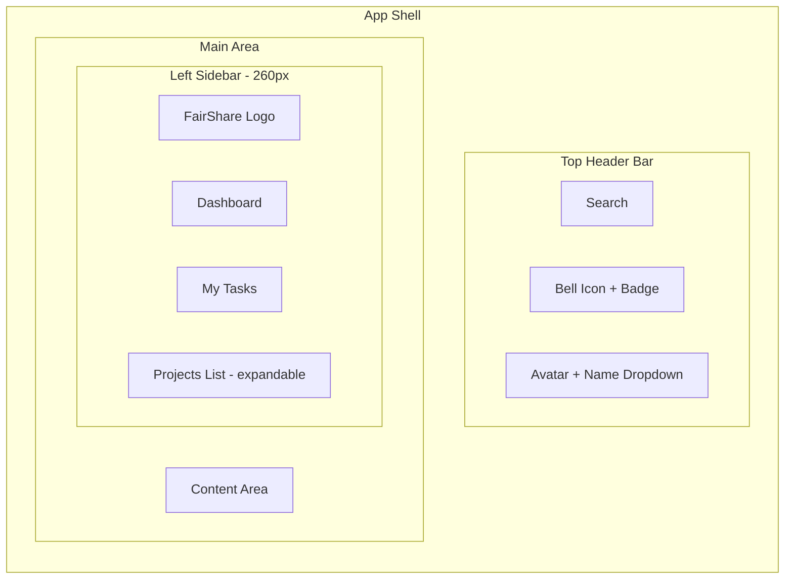
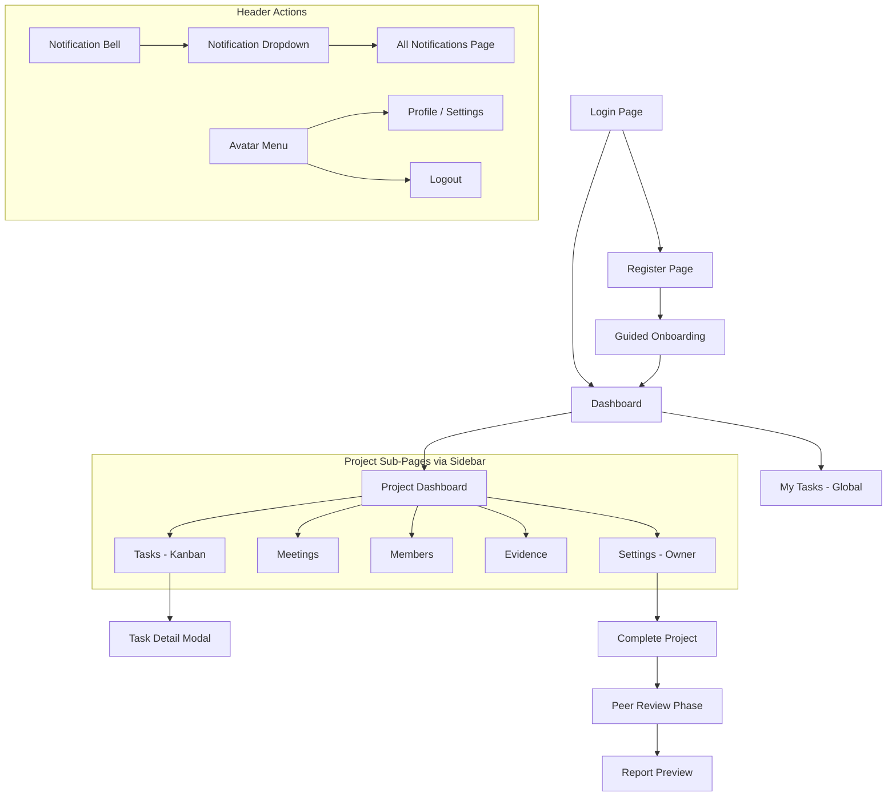
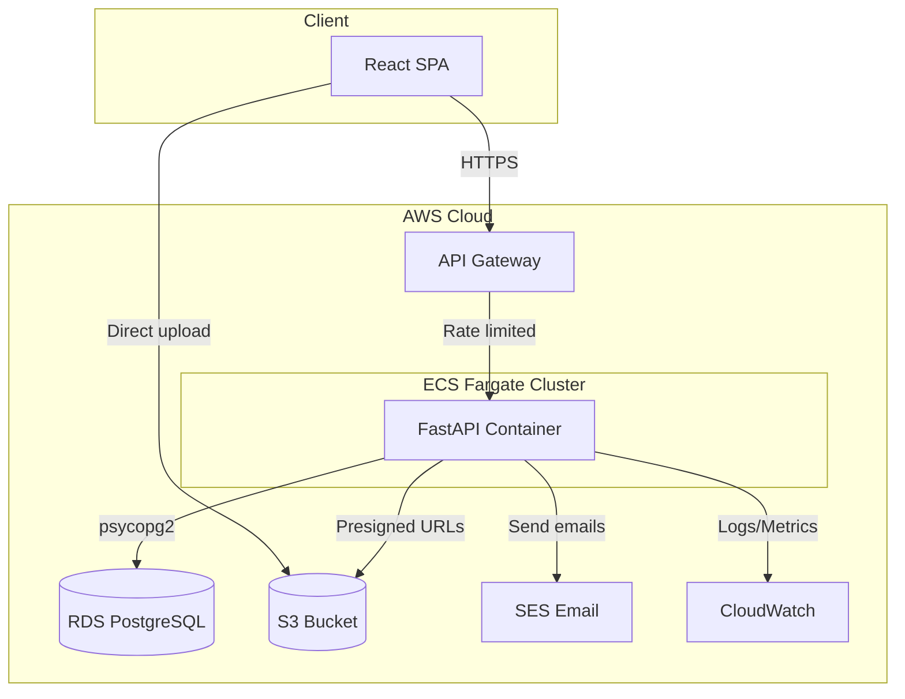
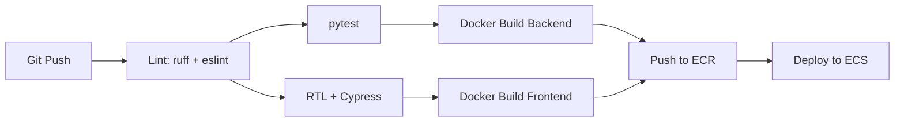

# FairShare -- Product Requirements Document

## 1. Problem Statement

In university group assignments, it is often unclear who actually did the work. Free-riders benefit from others' effort, diligent students feel resentment, and tutors have no visibility into individual contributions. Existing tools (Google Docs, WhatsApp, Trello) scatter evidence across platforms with no accountability trail.

## 2. Product Vision

FairShare makes group assignments more organised, transparent, and fair. It is a single platform where students plan tasks, log work, verify each other's contributions, resolve disputes democratically, and generate an auditable contribution report.

---

## 3. Tech Stack

| Layer | Technology |
|---|---|
| **Backend** | FastAPI (sync routes), Python 3.12, psycopg2 (raw parameterized SQL) |
| **Frontend** | React 18 + Vite, Material UI, Redux Toolkit, React Router |
| **Database** | PostgreSQL 16 on AWS RDS |
| **Auth** | Custom JWT (access token in HttpOnly cookie) |
| **File Storage** | AWS S3 (presigned URLs for upload/download) |
| **Email** | AWS SES (invitations, deadline reminders, notifications) |
| **Compute** | Docker containers on AWS ECS/Fargate |
| **CDN** | (not in scope for MVP) |
| **API Gateway** | AWS API Gateway (rate limiting layer in front of ECS) |
| **Monitoring** | AWS CloudWatch (logs, metrics, alarms) |
| **CI/CD** | GitHub Actions (lint, test, build Docker, deploy to ECS) |
| **Migrations** | Manual SQL migration files with a custom runner script |
| **Testing** | pytest (unit + integration), React Testing Library, Cypress E2E |

### Repository Structure

Monorepo:

```
groupwork/
  backend/
    app/
      main.py
      api/             # Route handlers
      db/              # Database connection, queries
      models/          # Pydantic schemas
      services/        # Business logic
      middleware/      # Auth, rate limiting, CORS
      migrations/      # Ordered .sql files
      utils/           # Helpers (S3, SES, PDF generation)
    tests/
    Dockerfile
    requirements.txt
  frontend/
    src/
      components/
      pages/
      store/           # Redux slices
      services/        # API client
      hooks/
      utils/
    tests/
    cypress/
    Dockerfile
    package.json
  docker-compose.yml   # Local dev (backend + frontend + postgres)
  .github/workflows/   # CI/CD
  infra/               # AWS deployment configs, task definitions
  docs/                # PRD, architecture diagrams
```

---

## 4. User Roles & Authentication

### 4.1 Single Role: Student

- All users are students. No tutor dashboard.
- Signup via email + password only (no OAuth).
- Password hashed with bcrypt.
- JWT issued on login, stored as an **HttpOnly, Secure, SameSite=Strict** cookie.
- Refresh token flow: access token (15 min TTL) + refresh token (7 day TTL) both in HttpOnly cookies.
- CSRF protection via a separate CSRF token in a non-HttpOnly cookie, validated on state-changing requests.

### 4.2 Registration Fields

- Full name
- Email (university email encouraged but not enforced)
- Password (min 8 chars, must contain uppercase, lowercase, digit)

### 4.3 Email Verification

- On registration, account is created in an "unverified" state.
- Verification email sent via AWS SES with a unique token link.
- Account is inactive until the user clicks the verification link.
- Unverified users cannot create or join projects.

### 4.4 Password Reset

- "Forgot Password" link on the login page.
- User enters their email -> system sends a password reset link (via SES) with a time-limited token (1 hour expiry).
- Link leads to a "Set New Password" page.
- Old sessions/refresh tokens are revoked on password change.

---

## 5. Core Features

### 5.1 Project Management

- **Create Project**: Name, description, subject/course (optional), due date.
- **Multi-project**: Students can participate in multiple projects simultaneously.
- **Project Dashboard**: Overview of tasks, upcoming deadlines, recent activity, member list.

### 5.2 Group Formation

Two methods for joining:

1. **Invite via Email**: Project creator enters email addresses -> system sends invitation email via AWS SES with a unique invite link. Recipient clicks link -> signs up (if new) or accepts (if existing).
2. **Join Code**: Project creator gets a 6-character alphanumeric code. Other students enter this code to join. Code expires after 7 days or when project reaches max members.

- Max group size: configurable per project (default 6).
- Creator is automatically the **Project Owner** (can manage settings, remove members).
- **Leave Project**: Members can voluntarily leave a project. The project owner cannot leave unless they first transfer ownership to another member via the Members tab ("Transfer Ownership" button -> select member -> confirmation dialog).
- **Ownership Transfer**: Owner selects a member -> transfers ownership -> former owner becomes a regular member.
- **No limit** on the number of active projects a user can join.

### 5.3 Task Board (Kanban)

- **Columns**: To Do, In Progress, Review, Done
- **Task Fields**:
  - Title (required)
  - Description (optional, plain text)
  - Assignee (one or more group members)
  - Priority: Low / Medium / High / Urgent
  - Due date
  - Subtasks (simple checklist: title + completed checkbox; inherit parent task's assignee)
  - Comments (threaded, with timestamps and author; editable within 5 minutes of posting, never deletable)
- **Drag-and-drop** between columns.
- **Filters**: By assignee, priority, due date.
- Moving a task to "Done" triggers a **peer verification prompt** (see 5.5).
- **Task Deletion**: Only the project owner can delete tasks (with confirmation dialog).

### 5.3.1 Task Edit Approval Flow

- **Project owner** can edit any task directly (title, description, priority, due date, assignees).
- **Other members** submit an edit request: they click "Request Edit" -> fill in proposed changes -> submit.
- The task shows a "Pending Edit" badge. The owner receives a notification with a diff view (old vs. proposed values).
- Owner can **Approve** (changes applied) or **Reject** (changes discarded, requester notified).
- Edit request history is logged.

### 5.4 Time Logging

- Members can log time against any task they are assigned to.
- Fields: hours (decimal), date, brief description of what was done.
- Time logs are **append-only** -- cannot be edited or deleted after submission.
- All time entries visible to all group members.

### 5.5 Peer Verification (Anti-Fraud)

When a member marks a task as "Done":

- All other group members receive a notification.
- Each member can **Verify** (confirm) or **Dispute** (challenge) the completion.
- A task is "Verified" when a majority of other members verify it.
- Disputed tasks are flagged and enter the dispute resolution flow (see 5.8).
- Verification status is recorded in the final report.

### 5.6 Evidence Upload

- Members can attach files to any task as evidence of contribution.
- Uploaded to **AWS S3** via presigned URLs (upload directly from browser to S3).
- Supported formats: PDF, PNG, JPG, DOCX, XLSX, TXT, ZIP.
- **5MB limit per file**, **50MB total per project**.
- File metadata (uploader, timestamp, size) stored in DB; actual file in S3.
- Files are immutable once uploaded (no replace/delete by users).

### 5.7 Meeting Notes

Structured template per meeting:

- **Meeting Date/Time** (required)
- **Attendees** (checkboxes for each group member)
- **Agenda** (text field)
- **Discussion Points** (text field)
- **Action Items** (list: description + assignee + due date; can auto-create tasks)
- **Notes** (general text field)

Attendance is tracked and reflected in the contribution report.

### 5.8 Dispute Resolution

When a contribution is disputed:

1. The disputer must provide a reason (text).
2. A **group vote** is triggered -- all members (including disputer and disputed) vote: Uphold or Reject the dispute.
3. Majority wins. Result is recorded.
4. Dispute history (reason, votes, outcome) is permanently logged and visible in the final report.
5. **Multiple disputes** can be active on the same task simultaneously.

### 5.9 End-of-Project Peer Review

When the project owner marks the project as "Complete":

1. All members must submit an **anonymous peer review** before the report is generated.
2. Each member rates every **other** member (no self-review) on:
   - Contribution quality (1-5)
   - Communication (1-5)
   - Reliability / meeting deadlines (1-5)
   - Overall contribution (1-5)
   - Optional written comment
3. Reviews are anonymous -- individual ratings are never revealed to other students.
4. Aggregate scores (averages) appear in the final report.
5. **Deadline**: 7 days after project is marked complete. If not all members submit by the deadline, the report is generated with available reviews. Non-submitters are marked as "Did not participate in peer review" in the report.

### 5.10 Contribution Report (PDF Export)

Generated after project completion + all peer reviews submitted. Includes:

- **Per-member task summary**: Tasks owned, completion status, verification status.
- **Time breakdown**: Total hours per member, broken down by task.
- **Activity timeline**: Visual chart showing when each member was active over the project duration (contributions over time).
- **Peer review aggregate scores** per member.
- **Dispute history** summary.
- **Meeting attendance** record.

Generated server-side (Python `reportlab` or `weasyprint`) and stored in S3 as PDF.

### 5.11 Project Lifecycle

```
Active -> Completed (owner triggers) -> Peer Review Phase -> Report Generated -> Archived (read-only)
```

- **Active**: Full functionality.
- **Completed**: No new tasks/edits, peer review opens.
- **Peer Review Phase**: Members submit reviews (deadline: 7 days).
- **Report Generated**: PDF created, downloadable by all members.
- **Archived**: Entire project becomes read-only. Data retained.
- **Deleted**: Soft delete with 30-day grace period (project hidden from UI but data retained). After 30 days, hard delete (all data including S3 files permanently removed). Only the project owner can delete.

### 5.12 Notifications

- **In-app**: Bell icon with notification dropdown + unread count.
- **Email** (via AWS SES):
  - Project invitation
  - Task assigned to you
  - Task moved to "Done" (verification needed)
  - Dispute filed
  - Deadline approaching (24h warning)
  - Peer review opened
  - Report ready

Users can configure email notification preferences (on/off per type).

---

## 6. UI/UX Specification

### 6.1 App Shell Layout

Fixed left sidebar (collapsible) + top header bar + main content area. Desktop-first with basic mobile support (sidebar collapses to hamburger menu, content stacks vertically on small screens). Light mode only. Blue accent color on a neutral grey/white base (professional, Jira-like).



**Top Header Bar** (fixed, full width):
- Left: FairShare logo/wordmark (clicking navigates to dashboard)
- Center: Search bar (search tasks, projects, members across all projects)
- Right: Notification bell (with unread count badge) + user avatar with dropdown (Profile, Settings, Logout)

**Left Sidebar** (fixed, 260px wide, collapsible to 64px icon-only):
- "Dashboard" link (home icon)
- "My Tasks" link (checkbox icon) -- shows all tasks assigned to you across all projects
- "Projects" section header with a "+" button to create a new project
- Each project listed by name, clickable to expand sub-navigation:
  - Tasks (kanban board)
  - Meetings
  - Members
  - Evidence
  - Settings (only visible to project owner)
- Active project/section highlighted with blue accent background
- Collapse toggle button at the bottom of the sidebar

### 6.2 Page Inventory & Wireframe Descriptions

**Page: Login**
- Centered card on a light grey background
- Fields: Email, Password
- "Log In" primary button (blue)
- "Don't have an account? Sign up" link below
- Error messages inline below fields

**Page: Register**
- Same centered card layout
- Fields: Full Name, Email, Password, Confirm Password
- Password strength indicator below password field
- "Create Account" primary button
- "Already have an account? Log in" link

**Page: Guided Onboarding (first login only)**
- Full-page welcome screen after first registration
- Step 1: "Welcome to FairShare!" with brief value prop
- Step 2: "Create your first project" (inline form: name, course, due date) OR "Join an existing project" (enter join code)
- Step 3: "Invite your team" (enter email addresses) -- skippable
- Progress indicator (dots) at the bottom
- "Skip" link in the corner to go straight to dashboard

**Page: Dashboard (Home)**
- Widget-based layout, responsive grid (2 columns on desktop, 1 on mobile):
  - **My Tasks** widget: List of tasks assigned to you across all projects, sorted by due date. Each row shows task title, project name, priority chip, due date. Clicking navigates to task.
  - **Upcoming Deadlines** widget: Calendar-style list of tasks and project due dates in the next 7 days.
  - **Recent Activity** widget: Feed of recent actions across your projects (e.g., "Alice completed 'Write Introduction' in CS101 Report", "New meeting note added to MATH200 Project").
  - **Quick Actions** widget: Buttons for "Create Project", "Join Project" (enter code), "Log Time".
- Empty state (no projects): Shows the guided onboarding flow instead of widgets.

**Page: Project Dashboard (landing page when clicking a project)**
- Top section: Project name, description, course, due date, project status badge (Active/Completed/Archived), member avatars in a row.
- Below: Redirects to the Tasks tab by default (Kanban board).

**Page: Tasks Tab (Kanban Board)**
- Four columns: To Do, In Progress, Review, Done
- Each column shows a count of tasks in the header
- Task cards show: Title, assignee avatar(s), priority color bar (left edge), due date, subtask progress (e.g., "2/5")
- Drag-and-drop cards between columns (react-beautiful-dnd or dnd-kit)
- "+" button at the top of each column to add a new task to that column
- Filter bar above the board: dropdowns for Assignee, Priority, Due Date range
- **Task Detail Modal** (opens on card click):
  - Centered modal overlay (60% width, scrollable)
  - Left section (70%): Title (editable), Description (editable), Subtasks checklist (add/toggle), Comments thread (chronological, with text input at bottom), Time Log section (list of entries + "Log Time" button)
  - Right section (30%): Status dropdown, Assignee multi-select, Priority dropdown, Due date picker, Evidence section (list of uploaded files + "Upload" button), Verification status (Verified/Pending/Disputed with voter breakdown)
  - Close button (X) in the top-right corner
  - **For non-owners**: Fields are read-only with a "Request Edit" button that opens an edit form overlay. Proposed changes are highlighted.
  - **For owners**: Fields are directly editable. If pending edit requests exist, a "Pending Edits" badge shows with a reviewable diff (Approve/Reject buttons).

**Page: Meetings Tab**
- List of past meetings in reverse chronological order, each as an expandable card
- "New Meeting" button at the top opens an inline form (not a modal) that pushes existing content down
- Inline form fields:
  - Meeting Date/Time picker
  - Attendees: Checkboxes for each group member (all checked by default)
  - Agenda: Text area
  - Discussion Points: Text area
  - Action Items: Repeatable row (description input + assignee dropdown + due date picker + "Add" button). Each action item has a "Create as Task" checkbox.
  - Notes: Text area
  - "Save Meeting" primary button, "Cancel" text button
- Saved meeting cards show: Date, attendee count, number of action items. Click to expand full details (read-only).

**Page: Members Tab**
- Grid of member cards (3 per row on desktop)
- Each card shows:
  - Avatar / initials circle
  - Full name
  - Role badge: "Owner" (blue) or "Member" (grey)
  - Stats: Tasks assigned / completed, Total hours logged, Meeting attendance rate (percentage)
- Project owner sees a "Remove" icon button on member cards (not on their own)
- Below the grid: "Invite Members" section with email input + "Send Invite" button, and a display of the join code with a "Copy" button
- Join code shows expiry date, with "Regenerate" button for the owner

**Page: Evidence Tab**
- Table/list view of all evidence files uploaded across all tasks in the project
- Columns: Filename, Task, Uploaded By, Date, Size
- Clicking a filename opens/downloads the file (via S3 presigned URL)
- Filter by task or uploader
- This is a project-wide evidence view -- individual task evidence is also accessible from the task detail modal

**Page: Project Settings (Owner only)**
- Form fields: Project name, Description, Course, Due date, Max members
- Danger zone at the bottom: "Complete Project" button (triggers lifecycle transition), "Delete Project" button (with confirmation dialog)

**Page: My Tasks (Global)**
- Accessed from the sidebar (not project-specific)
- Table/list view of all tasks assigned to the current user across all projects
- Columns: Task title, Project name, Status, Priority, Due date
- Sortable by any column
- Clicking a task navigates to that project's task board and opens the task modal

**Page: Profile / Settings**
- Accessed from avatar dropdown in the top header
- Sections:
  - Profile: Edit full name (email is read-only)
  - Change Password: Current password, New password, Confirm new password
  - Notification Preferences: Toggle switches for each email notification type (invitation, task assigned, task completed, dispute filed, deadline reminder, peer review, report ready)

**Page: Contribution Report Preview**
- Accessed after project reaches "Report Generated" state
- In-app rendered preview of the report contents:
  - Per-member task summary as a table
  - Time breakdown as a horizontal bar chart (member vs. hours)
  - Activity timeline as a line/area chart (date vs. contributions per member)
  - Peer review scores as a table (member vs. category averages)
  - Dispute history as a collapsible list
  - Meeting attendance as a table (meeting date vs. member checkmarks)
- "Download PDF" primary button at the top

### 6.3 Notification Dropdown

- Triggered by clicking the bell icon in the top header
- Dropdown panel (400px wide, max 500px tall, scrollable)
- Each notification: Icon (type-specific), title, brief message, timestamp ("2h ago"), unread indicator (blue dot)
- "Mark all as read" link at the top
- "See all notifications" link at the bottom -> navigates to a full notifications page (simple list view with pagination)

### 6.4 Key UI Components (Reusable)

- **ProjectCard**: Used on dashboard. Shows project name, course, due date, member count, task progress bar.
- **TaskCard**: Used on Kanban board. Shows title, assignee avatars, priority color, due date, subtask count.
- **MemberCard**: Used on Members tab. Shows avatar, name, role, stats.
- **NotificationItem**: Used in dropdown and full page. Shows icon, title, message, time, read state.
- **StatusBadge**: Chip component for project status (Active=green, Completed=yellow, Archived=grey) and task status.
- **PriorityChip**: Colored chip (Low=grey, Medium=blue, High=orange, Urgent=red).
- **EmptyState**: Illustration + message + CTA button (used when lists are empty).
- **ConfirmDialog**: Reusable confirmation modal for destructive actions.

### 6.5 Frontend UX Patterns

- **Error handling**: Toast/snackbar notifications (MUI Snackbar) for action errors ("Failed to save task"), inline messages for form validation. Full error page for 500s/network failures.
- **Loading states**: Skeleton loaders (MUI Skeleton) matching content shape for page loads. Circular spinners for button actions (submit, save).
- **Charting library**: Recharts for the contribution report charts (time breakdown bar chart, activity timeline).
- **Invite link behavior**: When a non-user clicks an invite link, they land on the registration page with their email pre-filled. After registration + email verification, the invite is auto-accepted.
- **Evidence preview**: Images and PDFs open in-browser via presigned URL. Other file types trigger a download.
- **Meeting notes**: Editable by the meeting creator or project owner. Cannot be deleted (accountability).

### 6.6 Navigation Flow Diagram



---

## 7. Security

### 7.1 SQL Injection Prevention

Since we are using raw psycopg2 (no ORM):

- **Every single query** must use parameterized queries (`%s` placeholders with tuple params). **Never** use f-strings or string concatenation for SQL.
- A custom query wrapper function will enforce this pattern.
- Integration tests will include SQL injection attempt test cases.

Example pattern:

```python
def get_user_by_email(conn, email: str):
    with conn.cursor() as cur:
        cur.execute(
            "SELECT id, email, password_hash FROM users WHERE email = %s",
            (email,)
        )
        return cur.fetchone()
```

### 7.2 Rate Limiting (Defense in Depth)

**Layer 1 -- AWS API Gateway**:
- 100 requests/second per IP (burst).
- Throttling returns 429.

**Layer 2 -- FastAPI Middleware** (slowapi):
- Auth endpoints: 5 requests/minute per IP (brute-force protection).
- File upload: 10 requests/minute per user.
- General API: 60 requests/minute per user.
- Report generation: 2 requests/hour per user.

### 7.3 Additional Security

- **Input validation**: Pydantic models for all request bodies.
- **CORS**: Strict origin whitelist (only the frontend domain).
- **File upload validation**: Check MIME type + file extension + magic bytes. Reject executables.
- **S3 presigned URLs**: Expire after 15 minutes. Scoped to specific bucket/key.
- **Password policy**: Min 8 chars, uppercase, lowercase, digit.
- **Account lockout**: 5 failed login attempts -> 15-minute lockout.
- **HTTP security headers**: HSTS, X-Content-Type-Options, X-Frame-Options, CSP.

### 7.4 Environment & Secrets Management

- **Local dev**: `.env` file (git-ignored) for DB connection, JWT secret, AWS credentials.
- **Production**: AWS Secrets Manager for all secrets (DB password, JWT secret, SES credentials). ECS task definitions reference secrets from Secrets Manager.

---

## 8. Database Schema (Key Tables)

```
users (id, email, password_hash, full_name, created_at, failed_login_attempts, locked_until)

projects (id, name, description, course, due_date, status, owner_id, join_code, join_code_expires_at, max_members, created_at)

project_members (project_id, user_id, joined_at)

invitations (id, project_id, inviter_id, invitee_email, token, status, created_at, expires_at)

tasks (id, project_id, title, description, status, priority, due_date, created_by, created_at, updated_at)

task_assignees (task_id, user_id)

subtasks (id, task_id, title, is_completed, completed_by, completed_at)

task_comments (id, task_id, user_id, content, created_at)

time_logs (id, task_id, user_id, hours, date, description, created_at)  -- append-only

evidence_files (id, task_id, user_id, s3_key, original_filename, file_size, mime_type, uploaded_at)

task_verifications (id, task_id, user_id, status [verified/disputed], created_at)

meetings (id, project_id, meeting_date, agenda, discussion_points, action_items_json, notes, created_by, created_at)

meeting_attendance (meeting_id, user_id, attended)

disputes (id, task_id, filed_by, reason, status [open/resolved], outcome [upheld/rejected], created_at, resolved_at)

dispute_votes (id, dispute_id, user_id, vote [uphold/reject], created_at)

peer_reviews (id, project_id, reviewer_id, reviewee_id, contribution_quality, communication, reliability, overall, comment, created_at)

notifications (id, user_id, type, title, message, is_read, related_entity_type, related_entity_id, created_at)

notification_preferences (user_id, notification_type, email_enabled)

refresh_tokens (id, user_id, token_hash, expires_at, created_at, revoked)
```

task_edit_requests (id, task_id, requested_by, proposed_changes_json, status [pending/approved/rejected], reviewed_by, created_at, reviewed_at)

activity_log (id, project_id, user_id, action_type, entity_type, entity_id, metadata_json, created_at)  -- for dashboard activity feed
```

Additional tables for new features:

```
email_verifications (id, user_id, token_hash, expires_at, created_at, verified_at)

password_resets (id, user_id, token_hash, expires_at, created_at, used_at)
```

All tables include appropriate foreign keys, indexes, and constraints. UUIDs for primary keys.

---

## 9. API Structure (Key Endpoint Groups)

All API routes prefixed with `/api/v1/`.

- `POST /api/v1/auth/register` -- signup (sends verification email)
- `POST /api/v1/auth/verify-email` -- verify email via token
- `POST /api/v1/auth/login` -- login (sets cookie)
- `POST /api/v1/auth/logout` -- clear cookie + revoke refresh token
- `POST /api/v1/auth/refresh` -- refresh access token
- `POST /api/v1/auth/forgot-password` -- send password reset email
- `POST /api/v1/auth/reset-password` -- reset password via token
- `GET /api/v1/users/me` -- current user profile
- `PUT /api/v1/users/me` -- update profile (name)
- `CRUD /api/v1/projects/` -- project management
- `POST /api/v1/projects/{id}/invite` -- send email invite
- `POST /api/v1/projects/{id}/join` -- join via code
- `POST /api/v1/projects/{id}/leave` -- leave project
- `POST /api/v1/projects/{id}/transfer-ownership` -- transfer ownership
- `DELETE /api/v1/projects/{id}` -- soft delete project (owner only)
- `POST /api/v1/projects/{id}/regenerate-code` -- regenerate join code
- `CRUD /api/v1/projects/{id}/tasks/` -- task management
- `POST /api/v1/tasks/{id}/request-edit` -- submit edit request (non-owner)
- `POST /api/v1/tasks/{id}/edit-requests/{rid}/review` -- approve/reject edit request (owner)
- `POST /api/v1/tasks/{id}/verify` -- verify task completion
- `POST /api/v1/tasks/{id}/dispute` -- file dispute
- `CRUD /api/v1/tasks/{id}/comments/` -- task comments
- `PUT /api/v1/tasks/{id}/comments/{cid}` -- edit comment (within 5 min)
- `POST /api/v1/tasks/{id}/time-logs` -- log time
- `POST /api/v1/tasks/{id}/evidence` -- get presigned upload URL
- `CRUD /api/v1/projects/{id}/meetings/` -- meeting notes (editable by creator/owner, never deletable)
- `POST /api/v1/projects/{id}/complete` -- trigger completion
- `POST /api/v1/projects/{id}/peer-review` -- submit peer review
- `GET /api/v1/projects/{id}/report` -- download contribution report PDF
- `GET /api/v1/projects/{id}/report/preview` -- in-app report preview data
- `GET /api/v1/notifications/` -- list notifications (cursor-based pagination)
- `PUT /api/v1/notifications/{id}/read` -- mark as read
- `PUT /api/v1/notifications/read-all` -- mark all as read
- `PUT /api/v1/users/me/notification-preferences` -- update preferences
- `POST /api/v1/disputes/{id}/vote` -- cast dispute vote
- `GET /api/v1/search/tasks` -- search tasks by title across user's projects

Pagination: All list endpoints use **cursor-based pagination** with `?cursor=<opaque_token>&limit=20` parameters. Response includes `next_cursor` (null if no more results).

Error responses: Consistent JSON format `{ "error": { "code": "TASK_NOT_FOUND", "message": "...", "details": {} } }` with appropriate HTTP status codes.

Timezone: All timestamps stored in **UTC** in the database. Frontend converts to user's local timezone (detected from browser) for display.

---

## 10. AWS Architecture



---

## 11. Rate Limit Summary

| Endpoint Category | Limit | Scope |
|---|---|---|
| Login / Register | 5/min | Per IP |
| Token Refresh | 10/min | Per IP |
| File Upload (presigned URL) | 10/min | Per User |
| Report Generation | 2/hour | Per User |
| General Read APIs | 120/min | Per User |
| General Write APIs | 60/min | Per User |
| AWS API Gateway (global) | 100/sec burst | Per IP |

---

## 12. Non-Functional Requirements

- **Performance**: API responses under 200ms (p95) for read operations.
- **Availability**: ECS with min 2 tasks for high availability.
- **Data Retention**: Archived projects retained indefinitely.
- **File Storage**: S3 Standard tier, lifecycle rule to move to Glacier after 1 year.
- **Logging**: Structured JSON logs to CloudWatch. Request ID tracing.
- **Environments**: Local (Docker Compose) -> Staging -> Production.

---

## 13. CI/CD Pipeline (GitHub Actions)



---

## 14. Implementation Phases

### Phase 1: Foundation
- Monorepo scaffolding, Docker Compose for local dev
- Database schema + migration runner
- Auth system (register, login, logout, refresh, JWT cookies, CSRF, email verification, password reset)
- User profile endpoint
- Rate limiting middleware (slowapi)
- Error handling middleware (consistent error responses)
- Backend test infrastructure (pytest + fixtures)
- Frontend scaffolding (Vite + MUI + Redux Toolkit + React Router)
- Login/Register/Forgot Password pages
- App shell (sidebar, header, routing)
- Guided onboarding flow

### Phase 2: Core Features
- Project CRUD + dashboard (widgets: My Tasks, Upcoming Deadlines, Recent Activity, Quick Actions)
- Group formation (invite via email with SES + join code + leave + ownership transfer)
- Task board (Kanban with drag-and-drop)
- Task details (assignees, priority, subtasks, comments with 5-min edit window)
- Task edit approval flow (request edit -> owner approve/reject)
- Time logging
- Global "My Tasks" page + task search

### Phase 3: Accountability Layer
- Evidence upload (S3 presigned URLs)
- Peer verification on task completion
- Meeting notes (structured template)
- Meeting attendance tracking
- In-app notifications

### Phase 4: Project Completion Flow
- Dispute system (file, vote, resolve; multiple per task)
- End-of-project peer review (7-day deadline, generate with partial if needed)
- Contribution report generation (PDF via weasyprint/reportlab)
- In-app report preview (Recharts for charts)
- Project lifecycle (complete -> review -> report -> archive)
- Soft delete with 30-day grace period
- Email notifications (SES)

### Phase 5: Production Readiness
- AWS infrastructure (RDS, ECS/Fargate, S3, API Gateway, CloudWatch, Secrets Manager)
- CI/CD pipeline (GitHub Actions -> ECR -> ECS)
- Frontend tests (React Testing Library + Cypress)
- Security hardening (headers, file validation, CORS, CSP)
- Monitoring, alarms, and structured logging (CloudWatch)
- SQL injection test suite
